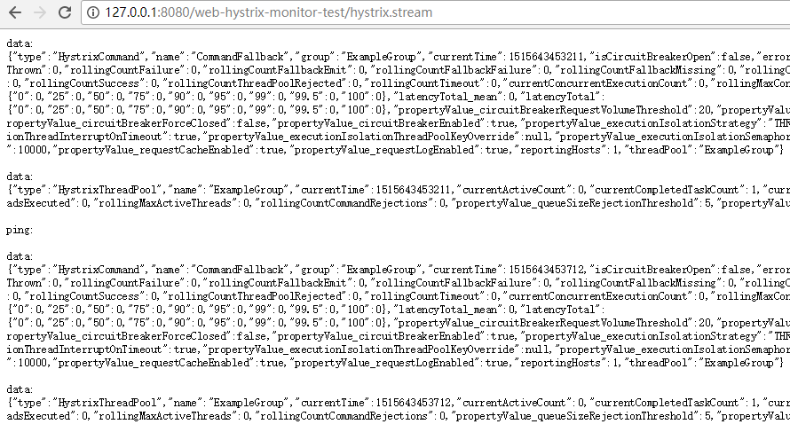

# hystrix监控模块添加测试项目

### 项目运行起来之后可以通过下列接口进行访问:

- 1访问http://127.0.0.1:8080/web-hystrix-monitor-test/shop
- 2访问http://127.0.0.1:8080/web-hystrix-monitor-test/hystrix.stream，系统会不断刷新以获取实时的数据；重复访问第一步，观察数据变化

 

### 使用gradle来编译运行脚本
执行以下两步，就能直接访问服务
- gradle build
- gradle tomcatRunWar